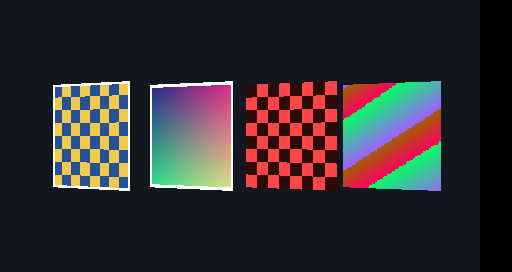

# Gate 0: unmodified PPSSPP fixture render

**Result: functional baseline passed on 2026-09-29; Gate 0 remains open for performance measurements.** PPSSPPHeadless, built from upstream commit `b9c5b28b8f69a78a18bdf381fb4d34b703d21e97`, ran the project's synthetic PSP homebrew fixture with the software renderer. The process exited 0, printed both expected markers, and saved a rendered image containing all four expected panels.

## Run

Build and dependency instructions are in [remaster-build.md](../remaster-build.md). The executable was the Debug `ppsspp/build/PPSSPPHeadless` built with `-DHEADLESS=ON`, `-DUNITTEST=ON`, and `-DUSE_SYSTEM_FFMPEG=ON`. From `ppsspp/`:

```bash
mkdir -p ../tests/workload/output
build/PPSSPPHeadless ../tests/workload/remaster_fixture.elf \
  --graphics=software --timeout-wall=30 \
  --screenshot-save=../tests/workload/output/reference.png
```

Observed console output (apart from a terminal title escape):

```text
REM_FIXTURE start frames=180
Screenshot saved to: ../tests/workload/output/reference.png
REM_FIXTURE done frames=180
```

The fixture ELF SHA-256 was `8189a894cb78069f215c3a8007d01a6f47def25c77aecb40806ccfb3235051b0`. The source hashes and PSPSDK build are recorded in the [fixture README](../../tests/workload/README.md). The PNG is 512×272 pixels and 4,577 bytes; its SHA-256 is `b4bac0834c4a547fe402e9722063342cbe5bc577c2c08bacecb2a035c2d65d2f`.



Visual inspection confirms the bordered yellow and blue checker, bordered two-axis gradient, small red checker, and changing color panel against a dark background. A second run with the same flags and a different output filename exited 0 and produced a byte-identical PNG (`cmp` exited 0). This confirms a stable software screenshot for the fixture on this host.

## Scope

This run verifies the unmodified PPSSPP build, fixture boot and completion, software rendering, and screenshot capture. Gate 0 still needs frame-time, startup-time, and memory baselines, preferably from a Release build on a display session for the intended Vulkan backend. The host has no active graphical display in this session; Vulkan device enumeration sees the Radeon 780M, but PPSSPP Vulkan rendering has not been run here.
